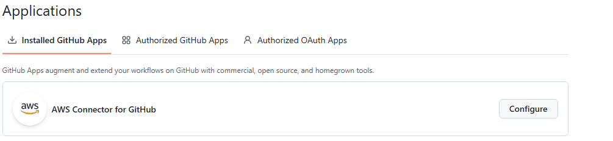

# Instruction
Objective
Design and implement a CI/CD pipeline using AWS CodePipeline and CloudFormation (with AWS SAM) that provisions and deploys a simple HOTH application.
You will build a CodePipeline with three stages:
• Source
• Build
• Deploy

The pipeline must deploy a serverless REST API composed of:
1. AWS Lambda
2. AWS Secrets Manager
3. Amazon API Gateway (REST API)
4. AWS Step function
5. AWS Glue jobs
6. AWS Authorizer for api endpoint


All infrastructure must be defined using CloudFormation and AWS SAM.
Manual resource creation via the AWS Console is not allowed.

  Deliverables 
  1. Cloudformation template (pipeline.yaml)
  2. Master SAM Template (hoth_migration_components.yaml) - This file have reference to all other individual template(.yaml) files
  3. API Gateway (fhir_register_member_api.yaml file should have the template for api resources )
  4. lambda (it should have app.py and authorizer.py )
  5. glue jobs (glue jobs template.yaml under glue-infra folder)
  6. step function (template.yaml under step-function-eventbridge folder)
  7. AWS Lambda
        •	Runtime: Python 3.12
        •	A simple handler that:
        –	Reads a secret from AWS Secrets Manager
        –	Returns a JSON response
        •	Proper IAM permissions must be defined using least privilege
  8. AWS Secrets Manager
        •	A secret must be created via CloudFormation
        •	The Lambda function must reference the secret using:
        –	Environment variables
        –	IAM permissions (no hard-coded values)
  9. API Gateway (REST API)
        •	Must be created using AWS SAM
        •	Must expose at least one endpoint:
        –	Method: POST
        –	Path: /health or /test
        •	API Gateway must integrate with the Lambda function
        •	Lambda proxy integration is acceptable 
  10. 
      . API gateway receives request. 
      .  In first place API will send the request to Authorizer lambda with headers (token, clientid and more)
      .  Authorizer lambda will do initial validation on input request/event and extract token.
      .  To verify token Authorizer will call SM to get client_id, Audience and some others which are require to call okta endpoint for token verification.
      .  Once Authorizer got all the details from SM. It will call okta API for verify token is valid or not 
      .  If valid return allow else deny back to API Gateway
      .  Returns allow/deny.

# Repository structure 
Cloudformation
|       pipeline.yaml
|
\---FHIR
    |   buildspec.yaml
    |   dev.json
    |   hoth_migration_components.yaml
    |   prod.json
    |   test.json
    |
    +---api-gateway
    |       fhir_register_member_api.yaml
    |
    +---glue-infra
    |       template.yaml
    |
    +---lambda
    |       app.py
    |       authorizer.py
    |
    +---secrets-manager
    |       fhir_migration_secrets.yaml
    |
    \---step-function-eventbridge
            template.yaml

# =================================================
# ====================================================

# HOTH Migration CI/CD Pipeline - Deployment Guide

## Source: GitHub Repository

This pipeline uses GitHub as the source repository via AWS CodeStar Connections.

## Prerequisites

Before deploying, ensure you have the following installed and configured:

```bash
# 1. Install AWS CLI v2
curl "https://awscli.amazonaws.com/awscli-exe-linux-x86_64.zip" -o "awscliv2.zip"
unzip awscliv2.zip
sudo ./aws/install

# 2. Configure AWS credentials
aws configure
# Enter your AWS Access Key ID, Secret Access Key, Region (e.g., us-east-1)

# 3. Verify AWS credentials
aws sts get-caller-identity

# 4. Install Git (if not already installed)
sudo apt-get install git -y  # Ubuntu/Debian
# or
sudo yum install git -y      # Amazon Linux/RHEL
```

---

## Step 0: Create CodeStar Connection to GitHub (Required First!)

Before deploying the pipeline, you must create a CodeStar Connection to authorize AWS to access your GitHub repository.

### Option A: Via AWS Console (Recommended)

```bash
# 1. Open AWS Console and navigate to:
#    Developer Tools > Settings > Connections
#    Or use this direct link:
echo "https://${AWS_REGION}.console.aws.amazon.com/codesuite/settings/connections"

# 2. Click "Create connection"
# 3. Select "GitHub" as the provider
# 4. Enter a connection name (e.g., "hoth-data-application-github")
# 5. Click "Connect to GitHub"
# 6. Authorize AWS Connector for GitHub in the popup
# 7. Click "Install a new app" to install AWS Connector on your GitHub account
# 8. Select your repository and click "Connect"
# 9. Copy the Connection ARN (you'll need this for deployment)
```

### Option B: Via AWS CLI

```bash
# Create the connection (this creates it in PENDING status)
aws codestar-connections create-connection \
    --provider-type GitHub \
    --connection-name "hoth-data-application-github" \
    --region us-east-1

# Note the ConnectionArn from the output
# IMPORTANT: You must still complete the authorization in the AWS Console!
# Go to the Connections page and click "Update pending connection"
```

### Verify Connection Status

```bash
# Check that your connection is in "AVAILABLE" status
aws codestar-connections get-connection \
    --connection-arn "arn:aws:codestar-connections:us-east-1:123456789012:connection/xxxxx" \
    --query "Connection.ConnectionStatus" \
    --output text

# Should return: AVAILABLE
```

---

## Quick Start - Automated Deployment

```bash
# Set required environment variables
export AWS_REGION="us-east-1"
export ENVIRONMENT="dev"
export APPLICATION_NAME="hoth-data-application"
export GITHUB_OWNER="bhattsachi"
export GITHUB_REPO="hoth-pipeline"
export GITHUB_BRANCH="dev"
export CODESTAR_CONNECTION_ARN="arn:aws:codeconnections:us-east-2:615299756109:connection/4925158b-afe3-4785-90b6-8dc4dedd5745"

# Make the deployment script executable
chmod +x deploy.sh

# Run full deployment
./deploy.sh deploy
```

---

## Manual Step-by-Step Deployment

### Step 1: Set Environment Variables

# Set required environment variables
export AWS_REGION="us-east-2"
export ENVIRONMENT="dev"
export APPLICATION_NAME="hoth-data-application"
export GITHUB_OWNER="bhattsachi"
export GITHUB_REPO="hoth-pipeline"
export GITHUB_BRANCH="dev"
export CODESTAR_CONNECTION_ARN="arn:aws:codeconnections:us-east-2:615299756109:connection/247abf24-ff00-4488-8fe6-01713d145aaa"

```bash
# Configure deployment variables
```

### Step 2: Validate CloudFormation Templates

```bash
# Validate the pipeline template
aws cloudformation validate-template \
    --template-body file://pipeline.yaml \
    --region ${AWS_REGION}
```

### Step 3: Deploy the Pipeline Infrastructure

```bash
# Deploy the CodePipeline stack with GitHub source
aws cloudformation deploy \
    --template-file cloudformation/pipeline.yaml \
    --stack-name ${APPLICATION_NAME}-pipeline \
    --parameter-overrides \
        ApplicationName=${APPLICATION_NAME} \
        Environment=${ENVIRONMENT} \
        GitHubOwner=${GITHUB_OWNER} \
        GitHubRepo=${GITHUB_REPO} \
        GitHubBranch=${GITHUB_BRANCH} \
        CodeStarConnectionArn=${CODESTAR_CONNECTION_ARN} \
    --capabilities CAPABILITY_NAMED_IAM \
    --region ${AWS_REGION} \
    --tags \
        Project=${APPLICATION_NAME} \
        Environment=${ENVIRONMENT}

# Wait for stack creation to complete
aws cloudformation wait stack-create-complete \
    --stack-name ${PROJECT_NAME}-pipeline \
    --region ${AWS_REGION}
```

### Step 4: Get Pipeline Outputs

```bash
# Get the Pipeline URL
PIPELINE_URL=$(aws cloudformation describe-stacks \
    --stack-name ${APPLICATION_NAME}-pipeline \
    --query "Stacks[0].Outputs[?OutputKey=='PipelineUrl'].OutputValue" \
    --output text \
    --region ${AWS_REGION})

echo "Pipeline URL: ${PIPELINE_URL}"

# Get the artifact bucket name
ARTIFACT_BUCKET=$(aws cloudformation describe-stacks \
    --stack-name ${APPLICATION_NAME}-pipeline \
    --query "Stacks[0].Outputs[?OutputKey=='ArtifactBucketName'].OutputValue" \
    --output text \
    --region ${AWS_REGION})

echo "Artifact Bucket: ${ARTIFACT_BUCKET}"

# Get the pipeline name
PIPELINE_NAME=$(aws cloudformation describe-stacks \
    --stack-name ${APPLICATION_NAME}-pipeline \
    --query "Stacks[0].Outputs[?OutputKey=='PipelineName'].OutputValue" \
    --output text \
    --region ${AWS_REGION})

echo "Pipeline Name: ${PIPELINE_NAME}"
```
export PIPELINE_NAME="hoth-data-application-pipeline"
export CONNECTION_ARN="arn:aws:codeconnections:us-east-2:615299756109:connection/1f6ccd5f-ab59-4669-8829-216b19d3d570"

# ════════════════════════════════════════════════════════════════════════════
# GET ROLE NAME
# ════════════════════════════════════════════════════════════════════════════
echo "Getting pipeline role..."
ROLE_ARN=$(aws codepipeline get-pipeline \
  --name $PIPELINE_NAME \
  --query "pipeline.roleArn" \
  --output text)
ROLE_NAME=$(echo $ROLE_ARN | cut -d'/' -f2)
echo "Role: $ROLE_NAME"

# ════════════════════════════════════════════════════════════════════════════
# ADD POLICY
# ════════════════════════════════════════════════════════════════════════════
echo "Adding CodeConnections permission..."
aws iam put-role-policy \
  --role-name $ROLE_NAME \
  --policy-name CodeConnectionsAccess \
  --policy-document "{
    \"Version\": \"2012-10-17\",
    \"Statement\": [
      {
        \"Effect\": \"Allow\",
        \"Action\": [
          \"codeconnections:UseConnection\",
          \"codeconnections:GetConnection\"
        ],
        \"Resource\": \"*\"
      }
    ]
  }"

echo "✓ Permission added!"
# ----------------
# Check existing policy
# -----------------------
aws iam get-role-policy \
 --role-name "$ROLE_NAME" \
 --policy-name "CodeConnectionsAccess"

# ════════════════════════════════════════════════════════════════════════════
# RETRY PIPELINE
# ════════════════════════════════════════════════════════════════════════════
export PIPELINE_NAME="hoth-data-application-pipeline"
export AWS_REGION="us-east-2"

echo "Restarting pipeline..."
aws codepipeline start-pipeline-execution --name $PIPELINE_NAME


### Step 5: Push Code to GitHub

```bash
# Clone your GitHub repository
git clone https://github.com/${GITHUB_OWNER}/${GITHUB_REPO}.git
cd ${GITHUB_REPO}

# Copy the FHIR application files to your repo
cp -r /path/to/FHIR .

# Commit and push
git add .
git commit -m "Initial commit: HOTH Migration application"
git push origin ${GITHUB_BRANCH}

# The pipeline will automatically trigger!
```

### Step 6: Monitor Pipeline Execution

```bash
# Get pipeline state
aws codepipeline get-pipeline-state \
    --name ${PIPELINE_NAME} \
    --region ${AWS_REGION}

# Get latest execution status
aws codepipeline list-pipeline-executions \
    --pipeline-name ${PIPELINE_NAME} \
    --query "pipelineExecutionSummaries[0]" \
    --region ${AWS_REGION}

# Watch pipeline execution in real-time
watch -n 10 "aws codepipeline get-pipeline-state --name ${PIPELINE_NAME} --region ${AWS_REGION} --query 'stageStates[*].{Stage:stageName,Status:latestExecution.status}' --output table"
```

### Step 7: Get Deployed Application Resources

```bash
# After pipeline completes successfully
APP_STACK_NAME="${PROJECT_NAME}-stack-${ENVIRONMENT}"

# Get API Gateway endpoint and other outputs
aws cloudformation describe-stacks \
    --stack-name ${APP_STACK_NAME} \
    --query "Stacks[0].Outputs" \
    --output table \
    --region ${AWS_REGION}
```

---

## Testing the Deployed API

### Health Check (No Authentication Required)

```bash
# Get API endpoint
API_ENDPOINT=$(aws cloudformation describe-stacks \
    --stack-name ${PROJECT_NAME}-stack-${ENVIRONMENT} \
    --query "Stacks[0].Outputs[?contains(OutputKey,'ApiEndpoint')].OutputValue" \
    --output text \
    --region ${AWS_REGION})

# Test health endpoint
curl -X POST "${API_ENDPOINT}/health" \
    -H "Content-Type: application/json"

curl -X GET "${API_ENDPOINT}/health"
```

### Authenticated Endpoints (Requires Okta Token)

```bash
# Replace with your actual Okta token
OKTA_TOKEN="your-jwt-token-here"

# Test authenticated endpoint
curl -X POST "${API_ENDPOINT}/test" \
    -H "Authorization: Bearer ${OKTA_TOKEN}" \
    -H "Content-Type: application/json"

# Register member
curl -X POST "${API_ENDPOINT}/register/member" \
    -H "Authorization: Bearer ${OKTA_TOKEN}" \
    -H "Content-Type: application/json" \
    -d '{
        "memberId": "MEM-001",
        "firstName": "John",
        "lastName": "Doe",
        "dateOfBirth": "1990-01-15",
        "email": "john.doe@example.com"
    }'
```

---

## Update Secrets After Deployment

After deployment, update the placeholder secrets with actual values:

```bash
# Update FHIR Migration Secret
aws secretsmanager update-secret \
    --secret-id "${PROJECT_NAME}/fhir-migration/${ENVIRONMENT}" \
    --secret-string '{
        "database_host": "your-actual-db-host",
        "database_port": "5432",
        "database_name": "fhir_migration_db",
        "database_username": "admin",
        "database_password": "your-secure-password",
        "api_key": "your-api-key",
        "encryption_key": "your-encryption-key",
        "environment": "'"${ENVIRONMENT}"'"
    }' \
    --region ${AWS_REGION}

# Update Okta Configuration Secret
aws secretsmanager update-secret \
    --secret-id "${PROJECT_NAME}/okta-config/${ENVIRONMENT}" \
    --secret-string '{
        "client_id": "your-okta-client-id",
        "client_secret": "your-okta-client-secret",
        "issuer": "https://your-domain.okta.com/oauth2/default",
        "audience": "api://'"${PROJECT_NAME}"'",
        "domain": "your-domain.okta.com",
        "required_scopes": ["openid", "profile"]
    }' \
    --region ${AWS_REGION}
```

---

## Useful Commands

### View Pipeline Logs

```bash
# View CodeBuild logs
aws logs tail /aws/codebuild/${PROJECT_NAME}-build --follow

# View Lambda logs
aws logs tail /aws/lambda/${PROJECT_NAME}-handler-${ENVIRONMENT} --follow

# View Step Functions logs
aws logs tail /aws/stepfunctions/${PROJECT_NAME}-${ENVIRONMENT} --follow
```

### Manually Trigger Pipeline
export PIPELINE_NAME="hoth-data-application-pipeline"
export AWS_REGION="us-east-2"

```bash
aws codepipeline start-pipeline-execution \
    --name ${PIPELINE_NAME} \
    --region ${AWS_REGION}
```

### Delete All Resources

```bash
# Delete application stack first
aws cloudformation delete-stack \
    --stack-name ${PROJECT_NAME}-stack-${ENVIRONMENT} \
    --region ${AWS_REGION}

# Wait for deletion
aws cloudformation wait stack-delete-complete \
    --stack-name ${PROJECT_NAME}-stack-${ENVIRONMENT} \
    --region ${AWS_REGION}

# Delete pipeline stack
aws cloudformation delete-stack \
    --stack-name ${STACK_NAME} \
    --region ${AWS_REGION}

# Note: S3 buckets with content won't be deleted automatically
# Empty them first if needed:
aws s3 rm s3://${ARTIFACT_BUCKET} --recursive
```

---

## Troubleshooting

### Pipeline Fails at Build Stage

```bash
# Check CodeBuild logs
aws codebuild batch-get-builds \
    --ids $(aws codebuild list-builds-for-project \
        --project-name ${PROJECT_NAME}-build \
        --query "ids[0]" \
        --output text) \
    --query "builds[0].logs.deepLink" \
    --output text
```

### Pipeline Fails at Deploy Stage

```bash
# Check CloudFormation events
aws cloudformation describe-stack-events \
    --stack-name ${PROJECT_NAME}-stack-${ENVIRONMENT} \
    --region ${AWS_REGION} \
    --query "StackEvents[?ResourceStatus=='CREATE_FAILED']"
```

### Lambda Function Errors

```bash
# Invoke Lambda directly for testing
aws lambda invoke \
    --function-name ${PROJECT_NAME}-handler-${ENVIRONMENT} \
    --payload '{"path": "/health", "httpMethod": "GET"}' \
    --cli-binary-format raw-in-base64-out \
    response.json

cat response.json
```

---

## Architecture Diagram

```
┌─────────────────────────────────────────────────────────────────────┐
│                        AWS CodePipeline                              │
├─────────────────┬─────────────────┬─────────────────────────────────┤
│   Source        │     Build       │           Deploy                │
│   (GitHub)      │   (CodeBuild)   │      (CloudFormation)           │
│   via CodeStar  │                 │                                 │
└────────┬────────┴────────┬────────┴─────────────┬───────────────────┘
         │                 │                      │
         ▼                 ▼                      ▼
┌─────────────────────────────────────────────────────────────────────┐
│                     Deployed Application                             │
├─────────────────────────────────────────────────────────────────────┤
│  ┌──────────────┐    ┌──────────────┐    ┌──────────────┐          │
│  │ API Gateway  │───▶│   Lambda     │───▶│Step Functions│          │
│  │ + Authorizer │    │  (Python)    │    │  (Workflow)  │          │
│  └──────────────┘    └──────────────┘    └──────────────┘          │
│         │                   │                   │                   │
│         ▼                   ▼                   ▼                   │
│  ┌──────────────┐    ┌──────────────┐    ┌──────────────┐          │
│  │    Okta      │    │   Secrets    │    │  Glue Jobs   │          │
│  │  (External)  │    │   Manager    │    │    (ETL)     │          │
│  └──────────────┘    └──────────────┘    └──────────────┘          │
└─────────────────────────────────────────────────────────────────────┘

GitHub Repository Structure:
├── FHIR/
│   ├── buildspec.yaml
│   ├── hoth_migration_components.yaml
│   ├── dev.json / test.json / prod.json
│   ├── api-gateway/
│   ├── lambda/
│   ├── glue-infra/
│   ├── secrets-manager/
│   └── step-function-eventbridge/

Cloudformation/
├── pipeline.yaml                              # Main pipeline CloudFormation template
│
└── FHIR/
    ├── buildspec.yaml                         # CodeBuild build specification
    ├── hoth_migration_components.yaml         # Master SAM template
    ├── dev.json                               # Development environment config
    ├── test.json                              # Test environment config
    ├── prod.json                              # Production environment config
    │
    ├── api-gateway/
    │   └── fhir_register_member_api.yaml      # API Gateway resources
    │
    ├── lambda/
    │   ├── app.py                             # Main Lambda handler
    │   └── authorizer.py                      # JWT token authorizer
    │
    ├── glue-infra/
    │   └── template.yaml                      # Glue jobs and resources
    │
    ├── secrets-manager/
    │   └── fhir_migration_secrets.yaml        # Secrets configuration
    │
    └── step-function-eventbridge/
        └── template.yaml                      # Step Functions workflow
```
# =====================================================

# Troubleshoot permission issue
# check attached policies
   aws iam list-attached-role-policies --role-name ${ROLE_NAME}

#Issue - Github pipeline (hot-pipeline) is not confgiured with AWS acees in github
#Fix - got to Github.com/bhattsachi/installation
    and configure the repo for the aws codebuild
    